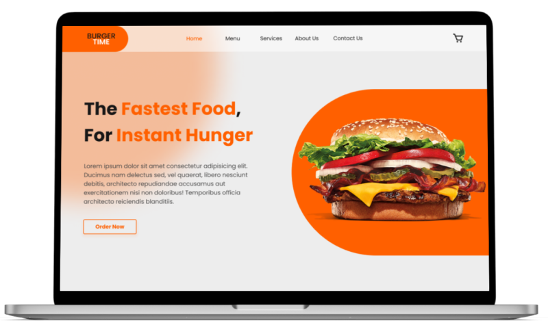

# [**BURGER TIME!** 🍔]()

This project was created to demonstrate my knowledge of the **TypeScript** programming language. It is a small restaurant food ordering app, where you can order burgers, drinks, salads, desserts, and breakfasts.

